# Personal Academic Website · Static-first Academic Portfolio Platform

[English](#english) · [Русский](#русский)

[](https://sitkovskiy.ru/)
[](https://arseniy24rus.github.io/personal-website/)
[](LICENSE)
[](LICENSE-CONTENT.md)

---

## English

### Overview

`personal-website` is not only a personal academic website. It is a static-first research portfolio platform that turns public researcher identifiers, bibliographic sources, media mentions, project pages, credentials and GitHub repositories into a reproducible public web profile.

The platform is built for an academic profile where evidence matters. It aggregates and normalizes publication and metric data from ORCID, OpenAlex, Crossref, Scopus, Web of Science and eLibrary/RSCI; renders publication lists and scientometric indicators; builds a visual collage of diplomas and certificates from raw ZIP/PDF/JPEG/PNG uploads; and generates media cards from monitored public sources.

The public site remains static and can be hosted by GitHub Pages, while data collection, enrichment and conversion run in GitHub Actions. Private API keys and cookies stay in Actions secrets and never need to be exposed in browser-side JavaScript.

### Public Website

Main domain: <https://sitkovskiy.ru/>  
GitHub Pages version: <https://arseniy24rus.github.io/personal-website/>

### Visual Overview

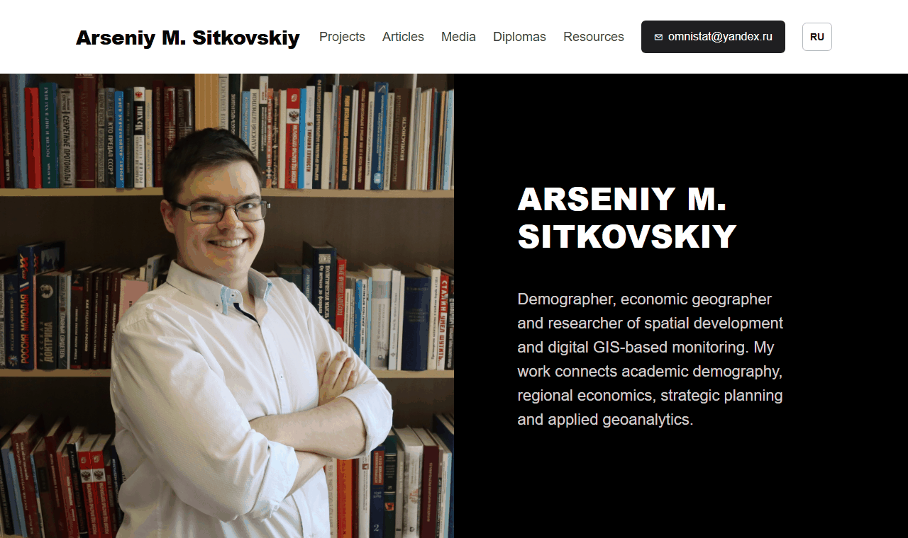

| Publications and metrics | Media, credentials and administration |
| --- | --- |
| 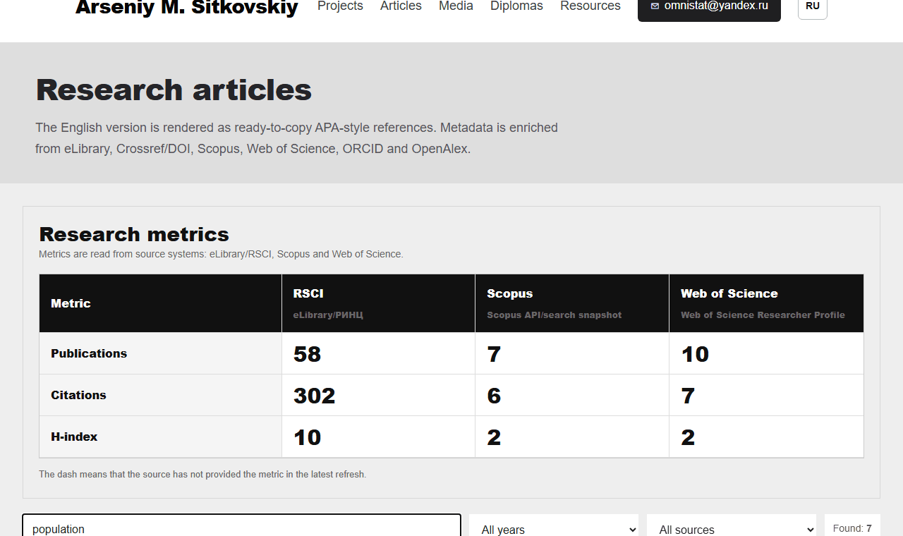 |  |
| 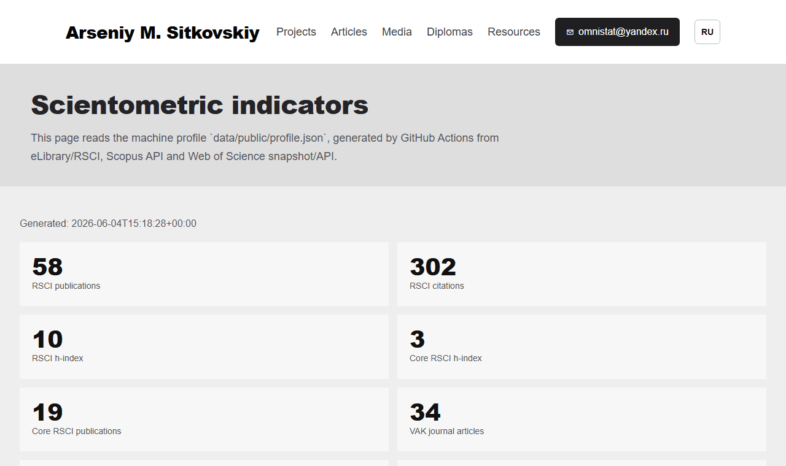 | 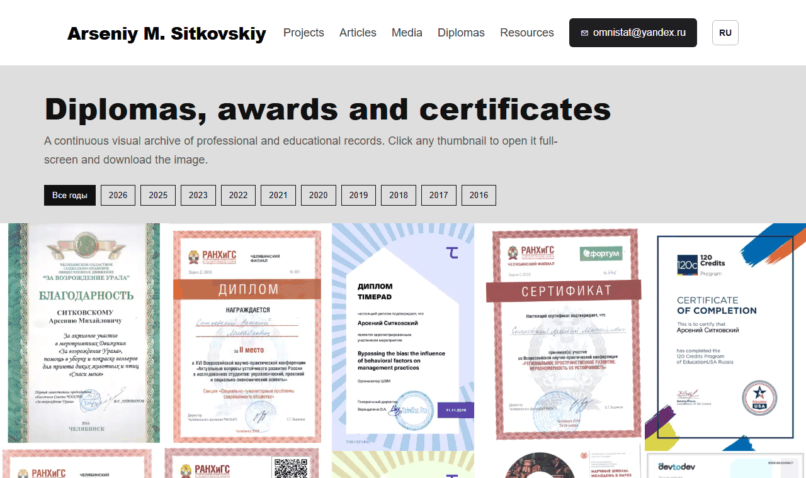 |
|  | 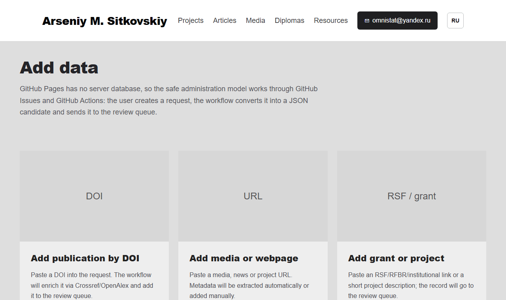 |

#### User Scenarios

| Publications and metrics | Diplomas and certificates |
| --- | --- |
| 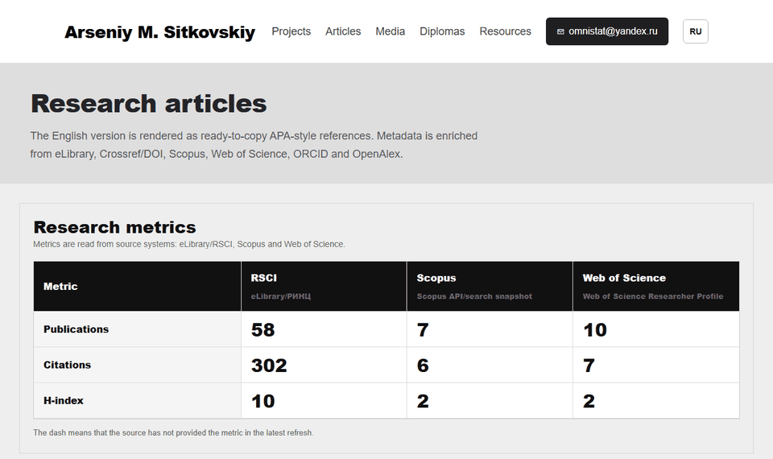 |  |

| Media cards | Admin and automation |
| --- | --- |
| 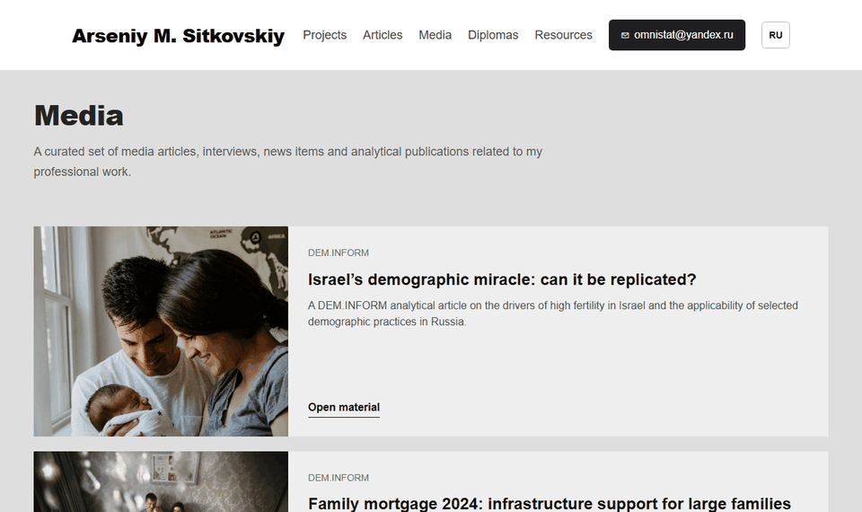 | 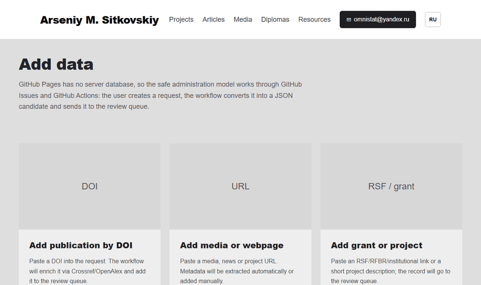 |

#### Data and Method Diagrams

| Platform architecture | Scientometric pipeline |
| --- | --- |
| 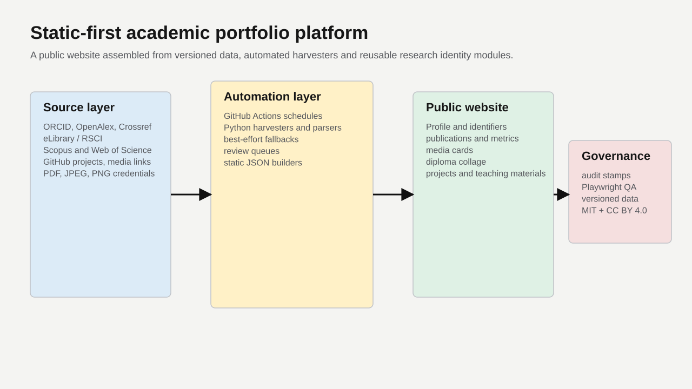 | 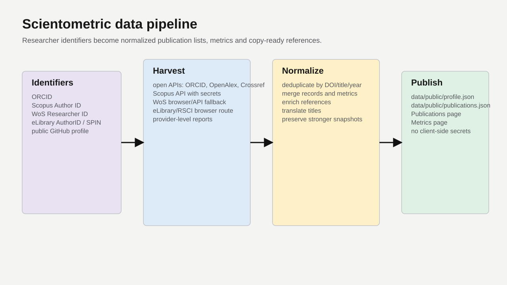 |

| Diplomas pipeline | Media monitoring pipeline |
| --- | --- |
| 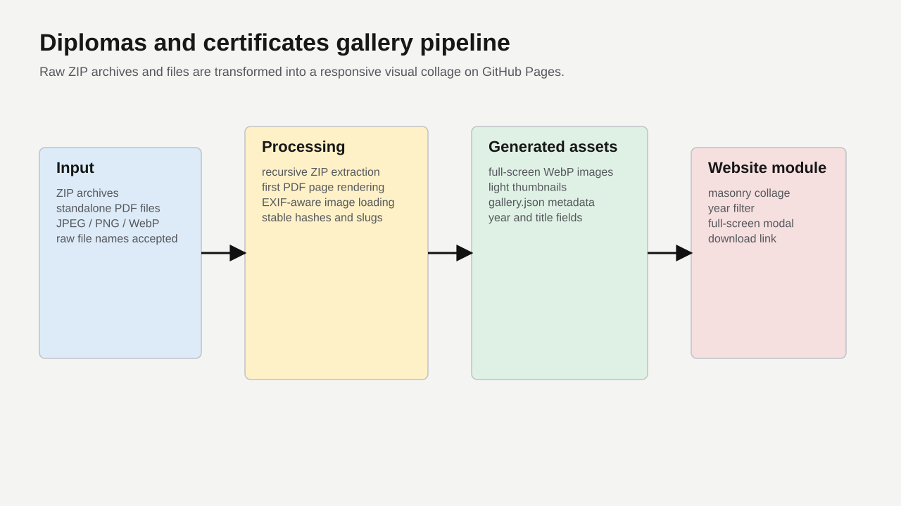 | 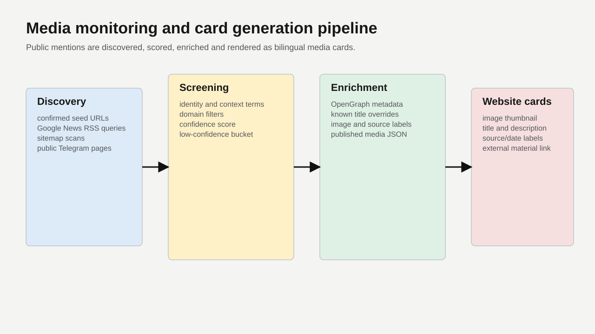 |

### What The Platform Does

- Publishes a bilingual academic profile with biography, affiliations, research identifiers, projects, teaching materials, media activity and contact links.
- Aggregates publication and metric data from ORCID, OpenAlex, Crossref, Scopus, Web of Science and eLibrary/RSCI into machine-readable public JSON.
- Builds publication and metric pages that can be refreshed through scheduled or manually triggered GitHub Actions.
- Converts raw ZIP archives and standalone PDF/JPEG/PNG/WebP files into a responsive diplomas and certificates gallery.
- Searches and curates media mentions through seed URLs, Google News RSS, sitemap scans, Telegram pages, metadata enrichment and confidence scoring.
- Provides a static-first administration model through GitHub Issues, review queues and Actions instead of a server-side CMS.

### Automation Model

The repository separates public presentation from data maintenance:

```text
Research identifiers and raw files
        ↓
GitHub Actions workflows
        ↓
Python harvesters, parsers and converters
        ↓
Versioned JSON, thumbnails and static assets
        ↓
GitHub Pages website
```

The main data refresh workflow updates bibliographic and media data. Separate workflows refresh the confirmed media corpus and build the diplomas gallery from uploaded archives. The design is deliberately best-effort: if one external provider fails, other providers can still refresh and previously stronger snapshots can be preserved.

### Repository Map

```text
.github/              GitHub Actions workflows
assets/               Static assets, styles, scripts, visuals and generated thumbnails
config/               Researcher identifiers and media-source configuration
content/              Source content, including uploaded diploma archives
data/                 Public JSON, source snapshots, media data and review queues
docs/                 Pipeline notes and integration documentation
scripts/              Harvesters, normalizers, converters and gallery builders
tests/e2e/            Playwright quality checks
*.html                Static website pages
```

### Reproducibility And Reuse

This project treats a personal website as research infrastructure. The public pages are static, but the underlying data pipeline is versioned, auditable and reproducible. Outputs such as `data/public/profile.json`, `data/public/publications.json`, `data/media/published.json` and `data/diplomas/gallery.json` can be inspected, diffed and rebuilt from the repository state.

### Local QA

```bash
npm install
npm run test:e2e
python -m http.server 4173
```

Then open <http://127.0.0.1:4173/> in a browser.

### License And Citation

Code is released under the MIT License. Website text, documentation, figures, generated visual materials and other non-code content are released under CC BY 4.0 unless a third-party source states otherwise. Citation metadata is provided in `CITATION.cff`.

---

## Русский

### Обзор

`personal-website` - это не просто персональный академический сайт. Это static-first платформа научного портфолио, которая превращает исследовательские идентификаторы, библиографические источники, медиа-упоминания, страницы проектов, дипломы и GitHub-репозитории в воспроизводимый публичный веб-профиль.

Платформа сделана для академического портфолио, где важны проверяемость и доказательная база. Она агрегирует и нормализует сведения о публикациях и метриках из ORCID, OpenAlex, Crossref, Scopus, Web of Science и eLibrary/РИНЦ; формирует страницы публикаций и наукометрических показателей; автоматически строит визуальный коллаж дипломов и сертификатов из сырых ZIP/PDF/JPEG/PNG-архивов; а также создаёт карточки материалов СМИ на основе мониторинга публичных источников.

Публичный сайт остаётся статическим и может работать на GitHub Pages, а сбор, обогащение и преобразование данных выполняются в GitHub Actions. Приватные API-ключи и cookie хранятся в Actions secrets и не попадают в клиентский JavaScript.

### Публичный Сайт

Основной домен: <https://sitkovskiy.ru/>  
Версия GitHub Pages: <https://arseniy24rus.github.io/personal-website/>

### Визуальный Обзор

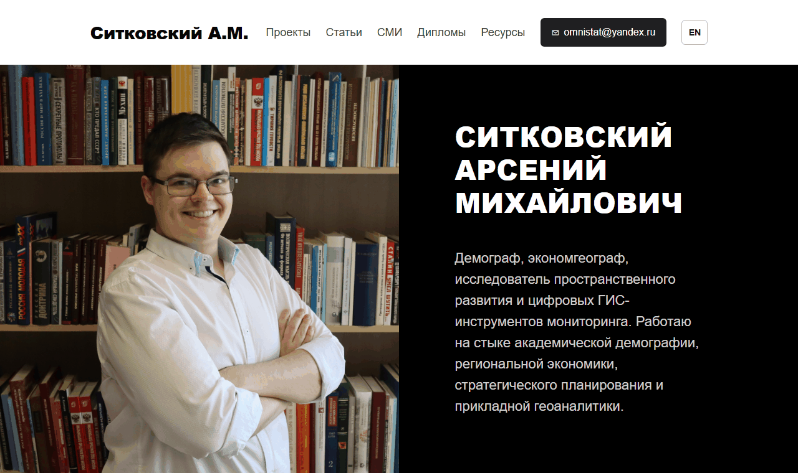

| Публикации и метрики | СМИ, дипломы и администрирование |
| --- | --- |
| 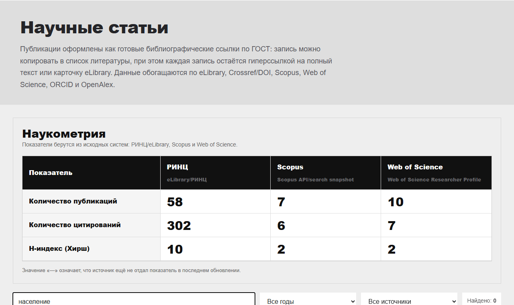 | 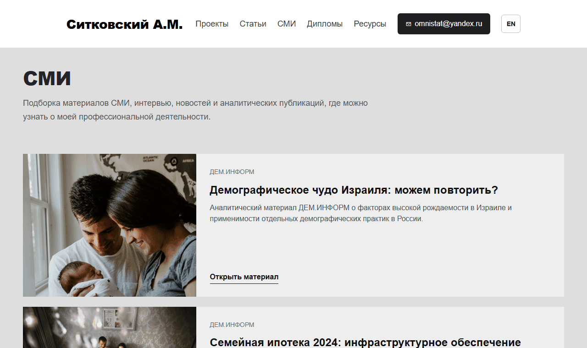 |
| 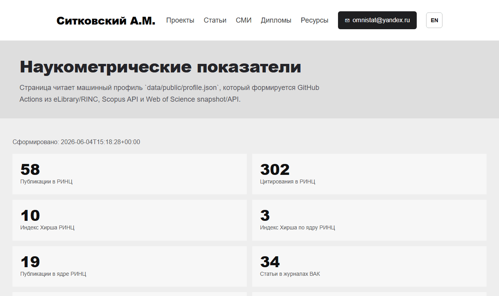 | 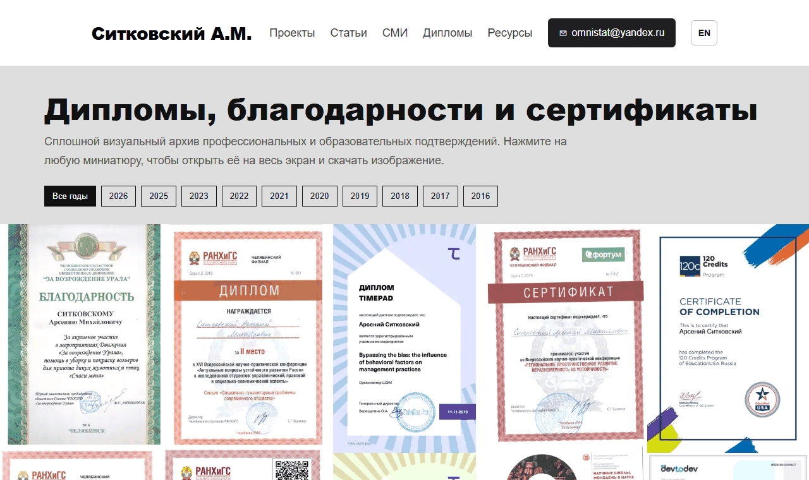 |
|  | 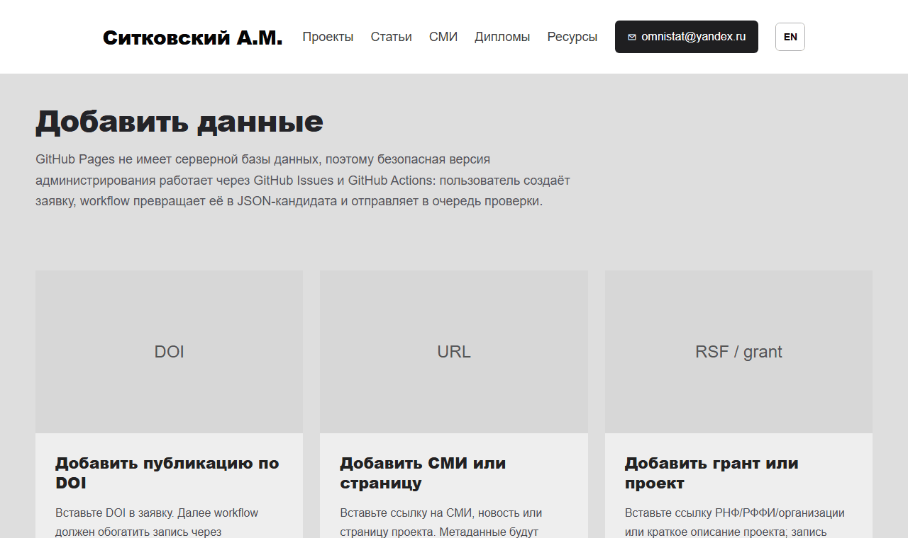 |

#### Пользовательские Сценарии

| Публикации и метрики | Дипломы и сертификаты |
| --- | --- |
| 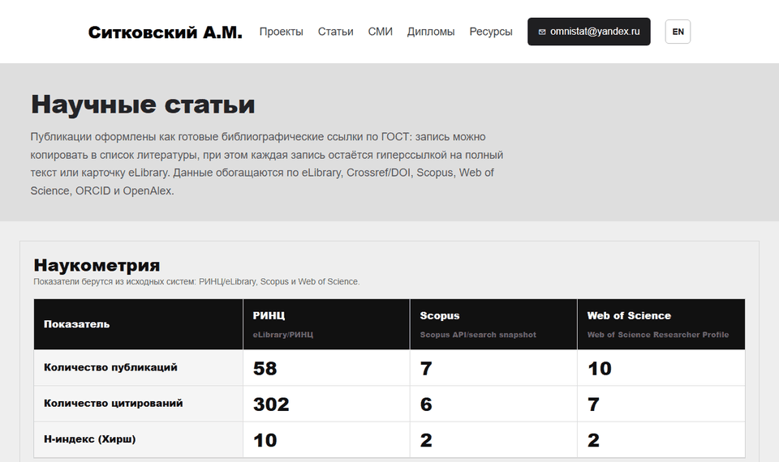 | 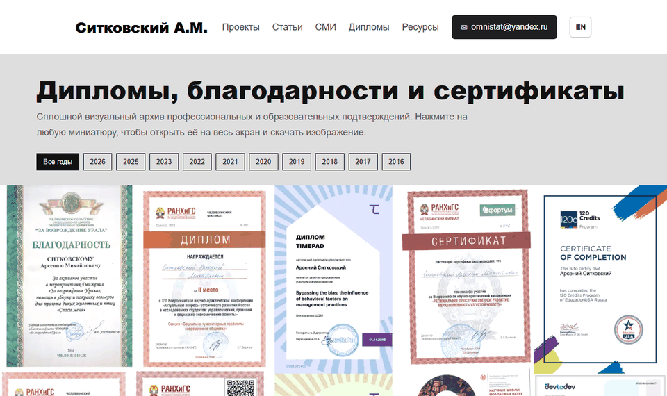 |

| Карточки СМИ | Администрирование и автоматизация |
| --- | --- |
|  | 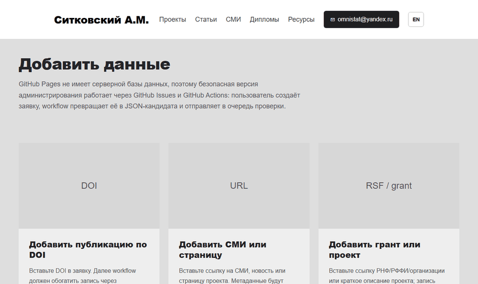 |

#### Схемы Данных И Методологии

| Архитектура платформы | Наукометрический пайплайн |
| --- | --- |
| 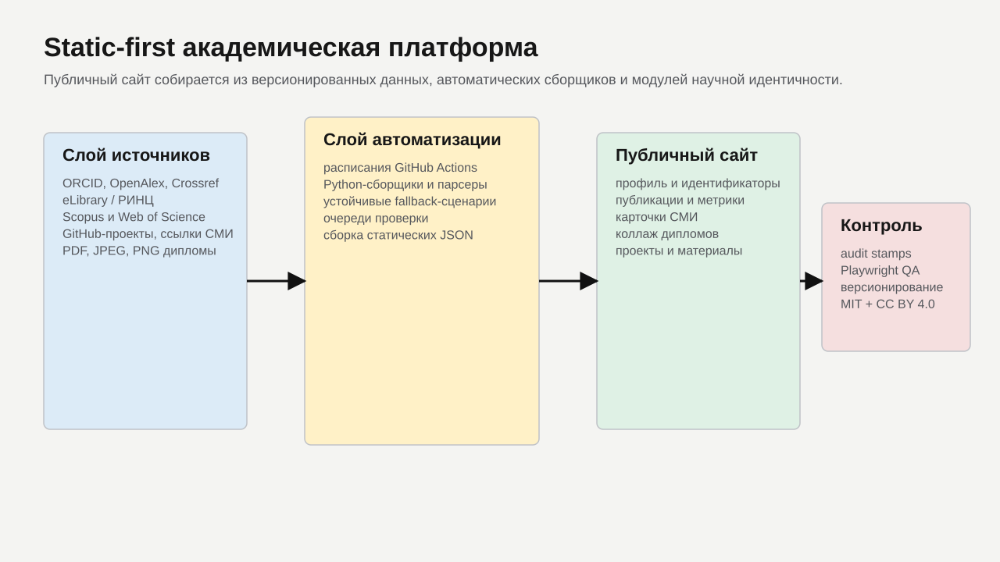 | 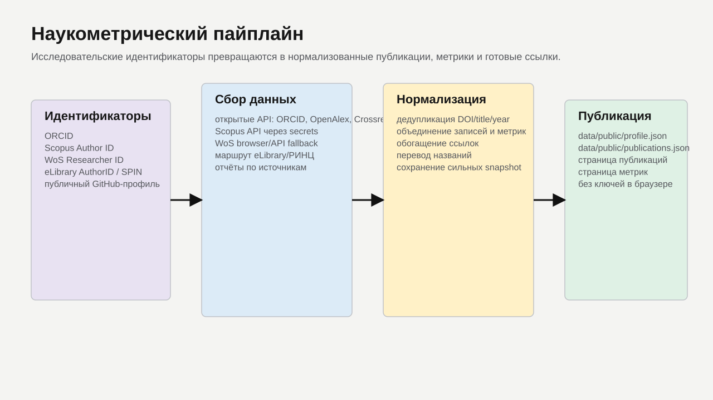 |

| Пайплайн дипломов | Пайплайн медиа-мониторинга |
| --- | --- |
| 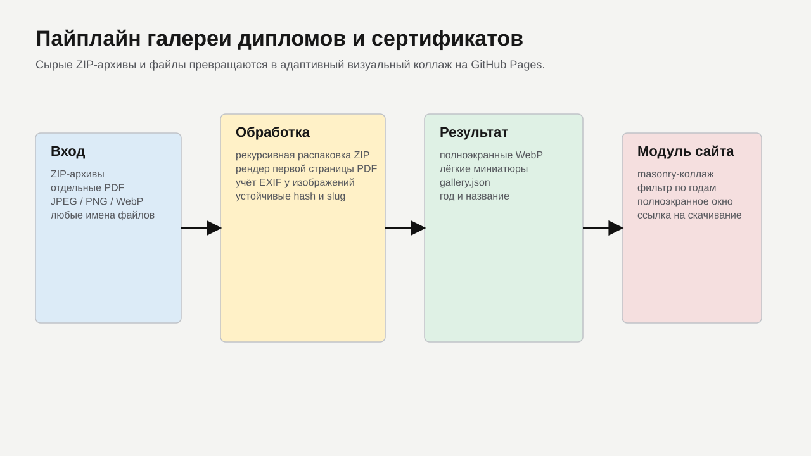 | 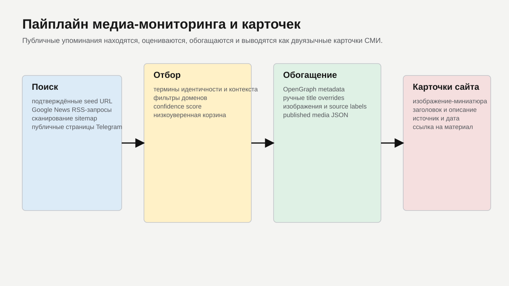 |

### Что Делает Платформа

- Публикует двуязычный академический профиль с биографией, аффилиациями, научными идентификаторами, проектами, учебными материалами, медиа-активностью и контактами.
- Агрегирует данные о публикациях и метриках из ORCID, OpenAlex, Crossref, Scopus, Web of Science и eLibrary/РИНЦ в машинно-читаемые публичные JSON-файлы.
- Формирует страницы публикаций и метрик, которые могут обновляться по расписанию или вручную через GitHub Actions.
- Превращает сырые ZIP-архивы и отдельные PDF/JPEG/PNG/WebP-файлы в адаптивную галерею дипломов и сертификатов.
- Ищет и курирует упоминания в СМИ через seed URL, Google News RSS, sitemap-сканирование, публичные страницы Telegram, обогащение метаданных и confidence scoring.
- Использует static-first модель администрирования через GitHub Issues, очереди проверки и Actions вместо серверной CMS.

### Модель Автоматизации

Репозиторий разделяет публичное представление и обслуживание данных:

```text
Идентификаторы исследователя и сырые файлы
        ↓
workflow GitHub Actions
        ↓
Python-сборщики, парсеры и конвертеры
        ↓
Версионированные JSON, миниатюры и статические assets
        ↓
Сайт GitHub Pages
```

Основной workflow обновляет библиографические и медийные данные. Отдельные workflow обновляют подтверждённый корпус СМИ и собирают галерею дипломов из загруженных архивов. Архитектура сделана устойчивой: если один внешний источник временно недоступен, остальные источники всё равно могут обновиться, а более сильные прежние snapshot-данные могут быть сохранены.

### Структура Репозитория

```text
.github/              workflow GitHub Actions
assets/               статические assets, стили, скрипты, визуалы и миниатюры
config/               идентификаторы исследователя и конфигурация медиа-источников
content/              исходный контент, включая загруженные архивы дипломов
data/                 публичные JSON, snapshot-данные, СМИ и очереди проверки
docs/                 заметки по пайплайнам и интеграциям
scripts/              сборщики, нормализаторы, конвертеры и генераторы галерей
tests/e2e/            проверки Playwright
*.html                статические страницы сайта
```

### Воспроизводимость И Повторное Использование

Проект рассматривает персональный сайт как исследовательскую инфраструктуру. Публичные страницы статические, но лежащий под ними пайплайн данных версионируется, проверяется и может быть воспроизведён. Выходные файлы `data/public/profile.json`, `data/public/publications.json`, `data/media/published.json` и `data/diplomas/gallery.json` можно просматривать, сравнивать и пересобирать из состояния репозитория.

### Локальная Проверка

```bash
npm install
npm run test:e2e
python -m http.server 4173
```

После запуска откройте <http://127.0.0.1:4173/> в браузере.

### Лицензия И Цитирование

Код распространяется по лицензии MIT. Тексты сайта, документация, схемы, созданные визуальные материалы и другой не-кодовый контент распространяются по CC BY 4.0, если для стороннего источника не указаны отдельные условия. Метаданные для цитирования находятся в `CITATION.cff`.
